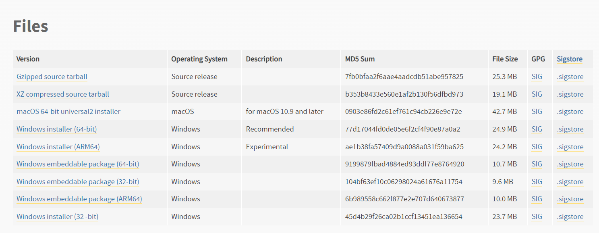
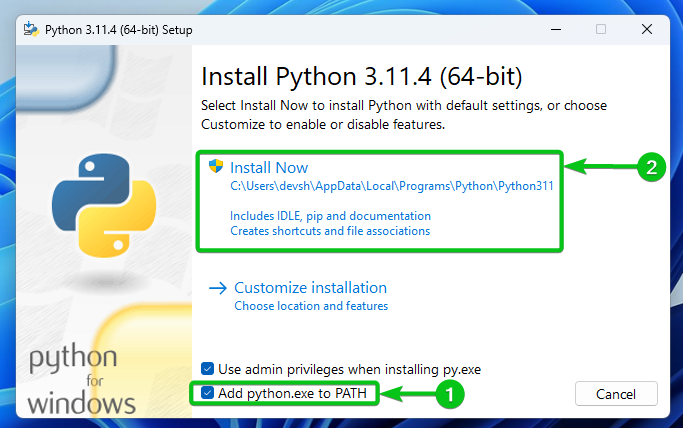
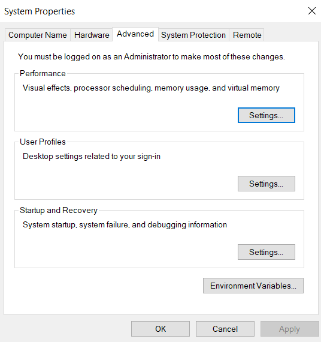

# NEXT-GEN PILOTS: AI ENHANCED DRONES IN ACTION  

# Workshop on Reinforcement Learning for Drone Control using Webots, Torch, and Gym

# Installation Steps
1. Κατεβάζουμε Webots [Webots Download](https://cyberbotics.com)
2. Κατεβάζουμε το repository ακολουθώντας τα παρακάτω βήματα:  
        a)Κάνουμε κλικ στο πράσινο κουμπί που βρίσκεται πιο πάνω στην σελίδα:  
    <a href="https://github.com/ElGreKost/RoboTalk"></a>  
        b)Επιλέγουμε download zip
3. Κάνουμε unzip το zipped αρχείο που μόλις κατεβάσαμε "Robotalk-main.zip"
4. Μετά το unzip πρέπει να βλέπουμε τον φάκελο "Robotalk-main". Εντός αυτού υπάρχει ένας ακόμα φάκελος "deepbots". Θέλουμε μέσω terminal να μεταφερθούμε σε αυτόν τον φάκελο "deepbots", χρησιμοποιώντας την εντολή ```cd <path_to_deepbots_folder>``` . (πχ. ```cd ~/Downloads/Robotalk-main/deepbots```)
5. Εκτελούμε την εντολή ```pip install .```  βρισκόμενοι εντός του φακέλου "deepbots"  

ΠΡΟΣΟΧΗ:   
1. Για να λειτουργήσει με επιτυχία η εγκατάσταση πρέπει η python να είναι σε version &lt;= 3.11
Για να δείτε την έκδοση τρέχετε την παρακάτω εντολή στο terminal
```python3 --version```  ή ```python --version``` ή ```py --version```
2. Βεβαιωθείτε στο βήμα 4 πως όταν κάνετε ```cd <path_to_deepbots_folder>``` το <path_to_deepbots_folder> δεν συμπεριλαμβάνει το zip φάκελο εντός του διότι αλλιώς δεν θα δουλέψει η εντολή. (πχ. δεν είναι κάτι τέτοιο: ```~/Downloads/Robotalk-main.zip/Robotalk-main/deepbots```)  
3. Πρωτού το βήμα 5, βεβαιωθείτε ότι βρίσκεστε στο "deepbots" folder εκτελώντας την εντολή ```pwd``` που εμφανίζει το directory στο οποίο βρίσκεστε.  

Για να γράψουμε κώδικα προτείνουμε το πρόγραμμα PyCharm ή το  Visual Studio Code  

Πληροφορίες σχετικά με το workshop:  

Controllers που θα χρησιμοποιήσουμε:
- ppo_controller       : Διακριτά actions με την χρήση του PPO Agent
- continuous_controller: Συνεχή actions με την χρήση του PPO Agent
- imitation-robot      : Εκπαιδευμένο μοντέλο με την χρήση μεθόδων imitation


# Εγκατάσταση Python 3.11 (Windows)
Σε περίπτωση που έχετε την έκδοση 3.12 (Για Windows)

Ανοίξτε τον παρακάτω σύνδεσμο: [Python 3.11.8 Download](https://www.python.org/downloads/release/python-3118/)  

**1.** Βρείτε και κατεβάστε τον κατάλληλο installer της Python 3.11.8.  
    
<div style="text-align:center;">
    
</div>

Συνήθως, για Windows, ο κατάλληλος installer είναι ο **Windows installer (64-bit)**. Μπορείτε να ελέγξετε τον τύπο του συστήματός σας ανοίγοντας τις ρυθμίσεις των Windows και πηγαίνοντας στο **System > About**.

**2.** Αφού κατεβάσετε τον installer, κάντε διπλό κλικ πάνω του για να το τρέξετε. Ακολουθήστε τα παρακάτω βήματα.  
<div style="text-align:center;">
    
</div>


**3.** Για να επιβεβαιώσετε ότι η εγκατάσταση ήταν επιτυχής, ανοίξτε το PowerShell και εκτελέστε τις παρακάτω εντολές: 
    ```python --version```
και 
    ```python3 --version```
Πρέπει να εμφανιστεί το μήνυμα ```Python 3.11.8```.

**4.** Αν δεν εμφανιστεί το παραπάνω μήνυμα, εκτελέστε την παρακάτω εντολή στο PowerShell:
    ```python -c "import os, sys; print(os.path.dirname(sys.executable))"```
Αυτή η εντολή θα επιστρέψει το μονοπάτι στο οποίο είναι αποθηκευμένη η Python.

**5.** Στη συνέχεια, στη γραμμή αναζήτησης των Windows, αναζητήστε **Edit System Environment Variables**. Πατήστε το **Environment Variables**  
<div style="text-align:center;">
    
</div>
Στο System Variables, αναζητήστε τη μεταβλητή **Path**, επιλέξτε την και πατήστε **Edit**  
      
Στη συνέχεια, πατήστε **New** και εισάγετε το μονοπάτι που επιστράφηκε από το βήμα 4.

**6.** Πατήστε **OK** για να αποθηκεύσετε τις αλλαγές και κλείστε τα παράθυρα.

Τώρα έχετε εγκαταστήσει την Python 3.11.8 επιτυχώς στο σύστημά σας.  

## Contributors

<table>
  <tr>
    <td align="center">
      <a href="https://github.com/ElGreKost">
        
        <br>
        <strong>Kwstis Kakkavas</strong>
      </a>
    </td>
    <td align="center">
      <a href="https://github.com/dimpap5555">
        
        <br>
        <strong>Jim Pap</strong>
      </a>
    </td>
    <td align="center">
      <a href="https://github.com/AlexGeorgantzas">
        
        <br>
        <strong>Georgios Alexandros Georgantzas</strong>
      </a>
    </td>
  </tr>
</table>

